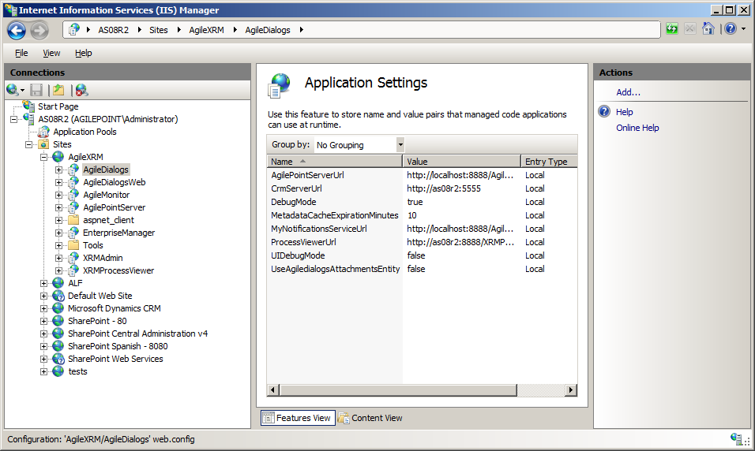

__[Home](/) --> [AgileDialogs Design Guide](/guides/AgileDialogs-DesignGuide.md) --> File__

# File control

This control is used to allow the user to upload files.

It can be configured in two modes using the *AllowMultiple* property:

-   **Single file**: AllowMultiple=False only allows to upload one single file.

    

-   **Multiple files**: AllowMultiple=True allows uploading multiple files.       
       
    

If the browser supports it, the File control allows **drag & drop** of files from
the PC (e.g. Internet Explorer 11):

The maximum size (in Bytes) allowed can be configured in the property *MaxFileSize*.

There are 2 options to manage uploaded files:

-   Upload them to server file system

-   Upload them as an attachment to a custom entity in XRM called *AgileDialogs
    Temp Attachments* (Part of the AgileXRM CRM Solution). This is the approach
    recommended for HA environments.

This behavior is configured at server level in AgileDialogs application:

In order to use the XRM entity, the *UseAgiledialogsAttachmentsEntity* setting
must be set to *true*.

Also, file control can be configured to delete the uploaded file using the
*AllowDelete* property. When *AllowDelete* property is set to true, file control
will show a button to delete the attachment.

> **Note**: For previously uploaded files, AgileDialogs does not delete the attachment
until the Next button is clicked.
