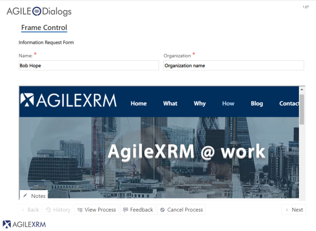
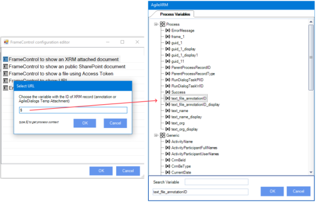
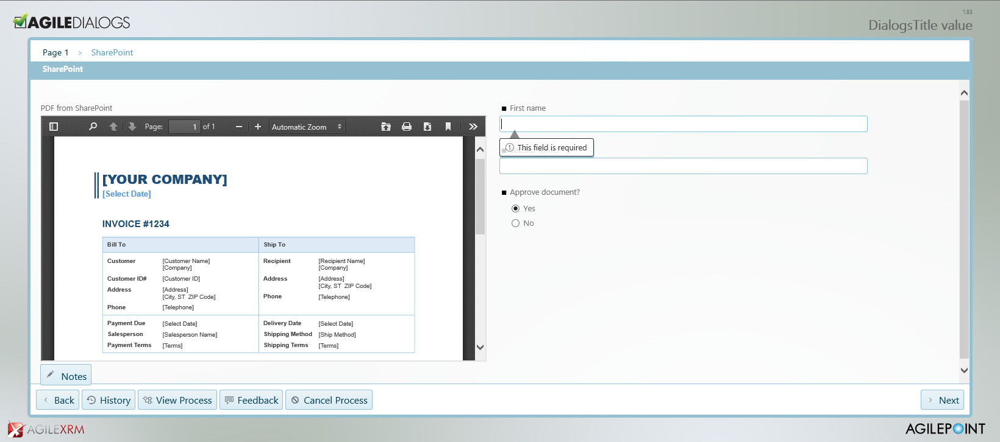
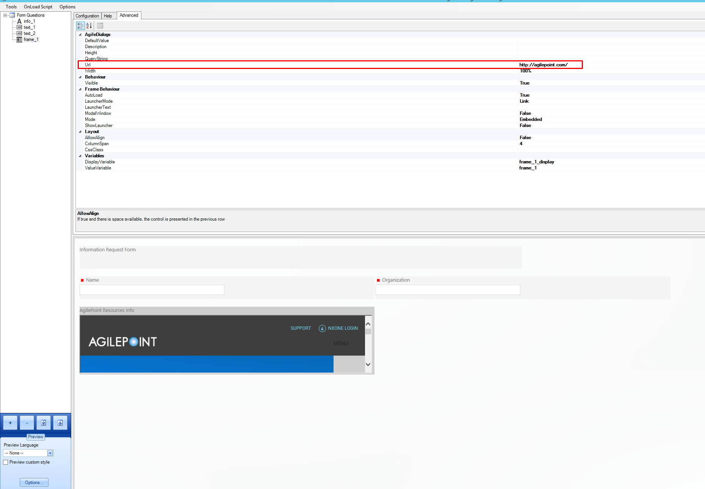
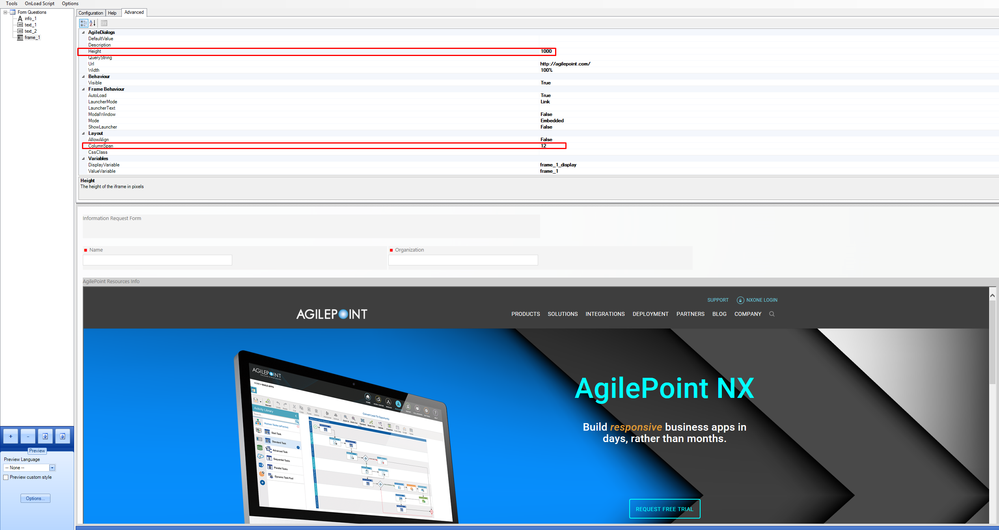
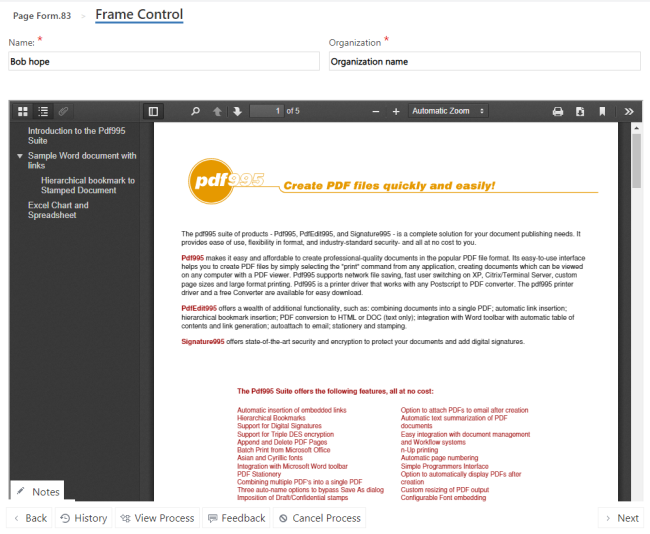
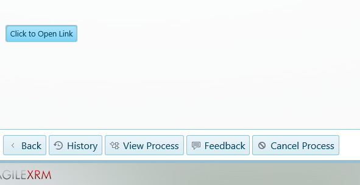
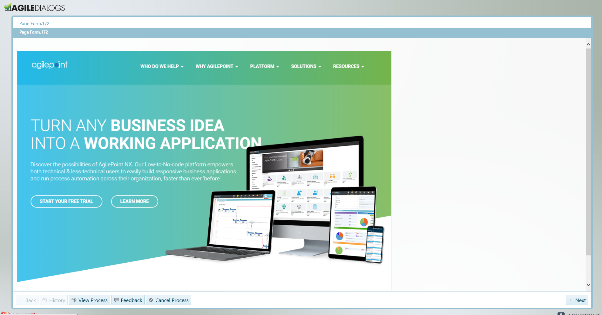

__[Home](/) --> [AgileDialogs Design Guide](/guides/AgileDialogs-DesignGuide.md) --> IFrame__

# IFrame

This control allows to insert an external web page or application inside the
AgileDialogs page. Very useful for information purposes, we could attach to our
dialog some webpage embedded inside an IFrame, shown along with the rest of the
Page Form controls.

Figure H: Example of a request form with two input textboxes, and an IFrame
attached below them, showing a custom URL designed by the process modeler.

If we want to /add a new IFrame to our form, we would follow these steps:

-   Press the plus button, and chose to attach the **IFrame** control inside our
    Page Form canvas.

-   Afterwards, Click on **Configure** to select the IFrame Type we want to build;
    a popup menu will come up:

There are three types of IFrame to be configured:

-   To show a CRM attached document: We want the IFrame to show a document
    content in our Page (an image, internal pdf...). If we choose this option
    (clicking OK), AgileDialogs will ask us for the process variable which will
    feed the IFrame inner content, **this variable should contains the document
    Id in CRM**  
      
    *Supported files types are: Jpeg and Png images, text and pdf formats.*

Once the value is selected, the IFrame will be shown in the Canvas View of the
modeler:

>   If we click on the *Advanced* Tab, we could notice that the needed details
>   are automatically filled in for us; The *QueryString* and *URL* properties
>   get default values (important: do not modify these). After finishing the
>   configuration customization and publish the process template, we'll see the
>   document content inside our IFrame on the Dialog execution (pictures below).

Figure I. Added property values in "CRM attached document' IFrame type

Figure J. Showing IFrame content (an image in .png format previously loaded in
the Dialog)

-   To show a SharePoint attached document: We want the IFrame to show a
    document content in our Page. If we choose this option (clicking OK),
    AgileDialogs will ask us for the process variable which will feed the IFrame
    inner content, **this variable must contains the SharePoint document URL**

    *Supported files types are: Jpeg and Png images, text and pdf formats.*

    **Tip: Store the URL of SharePoint site as Shared Custom attribute.**

    

    Important: The user that executes Agiledialogs should have access to the
    SharePoint file.

-   The last option will be *Empty frame control*. Meant for normal URLs to be
    shown in the Dialog. It lets the user customize the parameters to be
    configured.

From now on, let's suppose we are configuring and Empty frame control, to
explain better the features to customize one by one.

-   Go to the *Advanced* tab, and type the desired website you want to show on
    your Dialog, in the *URL* property. If the provided value is correct, the
    website should be up and running on the lower side of the test canvas.

-   Manipulate the control properties accordingly to style the IFrame as desired
    (at the example below, changed *columnspan* and *height* property, for a
    better visualization of its inner website).

Once published, this would be how the form looks like:

There are various ways to show the IFrame, as it will be explained next.

The properties for the IFrame control are:

-   **AutoLoad**: If activated, it will launch the IFrame on the Form loading
    process. If false, the IFrame will wait for a triggering event (click on a
    button/link) to launch the IFrame content.

    **Important**: if *Mode* is set to *embedded*, this property will not be
    able to toggle to *false*, as this mode makes the IFrame load on the page
    initialization by default.

-   **LauncherMode:** Can be set to:

>   **-***Button.* A button interface is placed to launch the IFrame.

>   *-Link.* A link interface is placed to launch the IFrame.

**Important:** If *Mode* is set to *embebbed*, the property *LauncherMode* will
have no effect, because there will be no user interaction for loading such
IFrame content.

-   **URL**: Address of the web page to insert in the IFrame. Needs to be
    absolute and valid URL:  
    e.g.: <http://mysite.com/myresource.aspx>

-   **QueryString**: set of parameters to be sent to the IFrame web page who is
    responsible to deal with them accordingly. Given a case in which we are
    having an IFrame that requires two values passed by querystring, we should
    type those *namevariable=valuevariable* separated by **&**. The IFrame mechanism
    will do the rest (no need to type the **?** character to separate such
    querystring, as you would normally do typing the whole URL). The host canvas
    (the Main page we are customizing) is going to pass those parameters to its
    dependent IFrame.  
    e.g.: *param1=value1&param2=value2* (image below)

-   **LauncherMode**: It can be adjusted to *Link* (there will be a link to
    launch the IFrame) or button (picture below). **Important**: If *Mode* set to
    *Embedded* there will be no link or button to show in the screen as the
    control loads automatically.

-   **ModalWindow**: If set to *true*, the user will not be allowed to press any
    option or button in the parent window, until the modal window is closed. If
    set to *false*, the new opened window would be independent to its *parent*,
    and will permit the process flow to keep going if the user desires to, no
    matter if the modal window is still opened.

-   **Mode:** it can be set in three different ways:

    -   **Embedded:** The IFrame will be shown inside the main container canvas, being
    in the same browser as the main process flow.

    

    -   **Window:** The IFrame will be shown as a new window outside the container
    canvas.

    

    -   **External:** external window outside the container canvas. The default
    behavior of this window will not allow the user to interact with the main
    window as it is going to remain locked until our external dialog has been
    closed.

    

-   **Width:** in pixels

-   **Height**: in pixels
