__[Home](/) --> [AgileDialogs Design Guide](/guides/AgileDialogs-DesignGuide.md) --> Page Form Shape__

# Page Form Shape

This shape is only usable in AgileDialogs. It cannot be used in AgileXRM
processes.

When a dialog is run, this shape presents a form to the user.

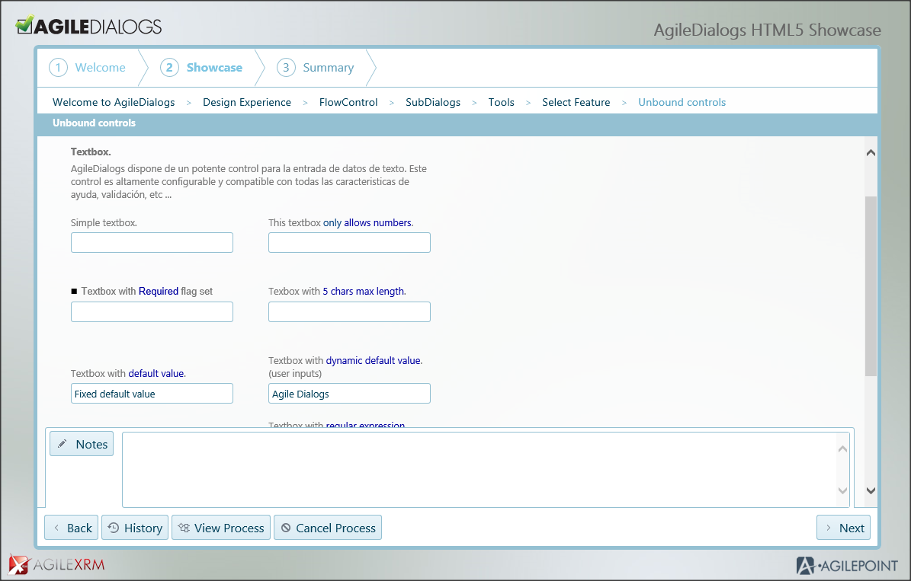

>   At runtime, the AgileDialogs window has several parts:

-   The top part shows the title of the dialog. This title is shared by all
    steps in the same dialog

-   Under the title of the dialog, the name of the page is presented

-   In the main area, the questions/controls are presented. This is the section
    that changes to show the corresponding questions for each Page Form

-   In the bottom of the window there is a set of buttons that allows the user
    to take actions in the dialog

## Page Configuration Window

This window is used to configure a form in AgileDialogs, to launch this windows
select the page shape and click the ellipsis of the FormConfiguration parameter
in the properties window.

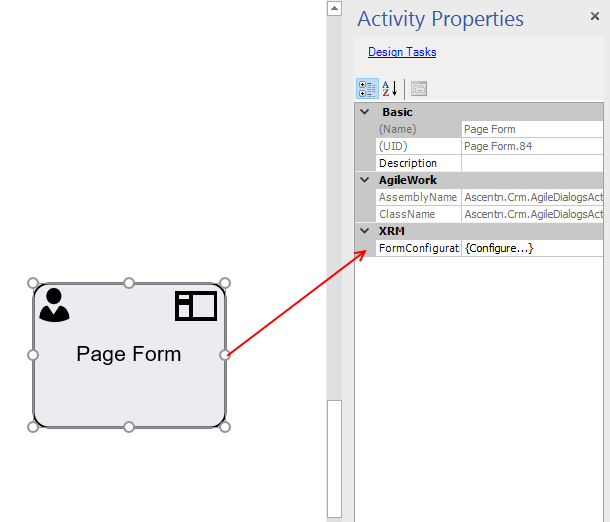

This window is comprised of 4 sections:

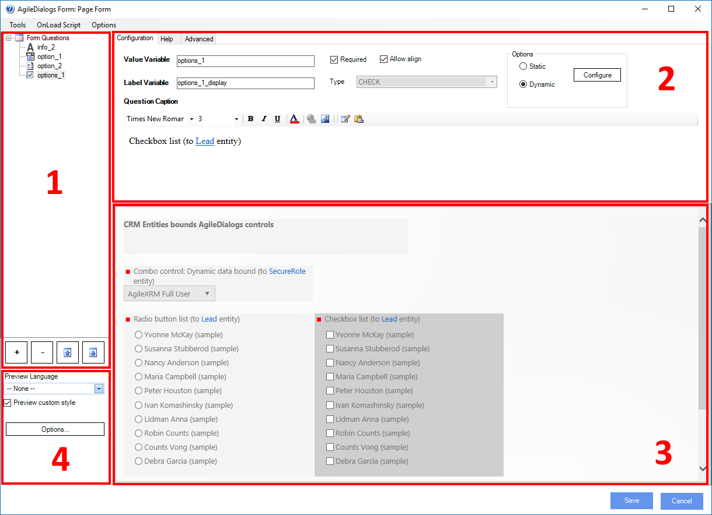

  
**Control List**: In the top left part of the window it lists the controls that
are already added to the form. These are identified by the name of the variable
which will store the value provided by the user:

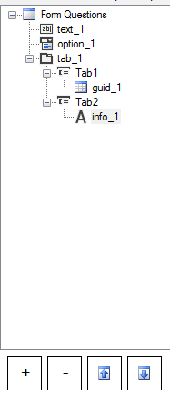

>   The buttons on the bottom are used to *Add*, *Remove* controls and to move
>   them *Up* and *Down* in the form.

>   It is also possible to Copy & Past controls using the contextual menu (mouse
>   right-button click).

1.  **Control Configuration**: To configure a specific control, select it in the
    list, and the properties of the selected control are presented on the right
    panel:

1.  **Page Preview**: The bottom right panel of the window shows a design-mode
    preview of the dialog:

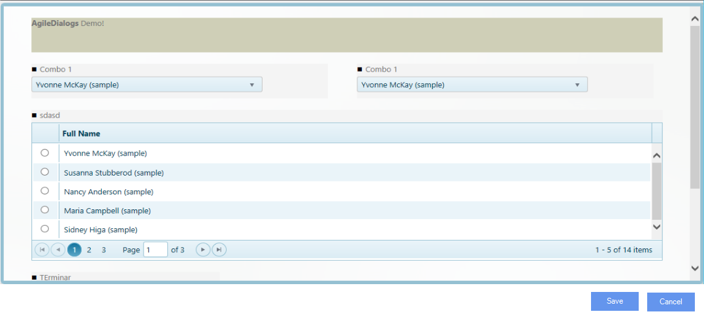

>   At design-time the controls have a slightly darker background color to help
>   in the design effort but this is not shown at runtime.

>   The selected control will have even a darker background color to clearly
>   identify it.

1.  **Form Properties**

    You can access to the configuration window by clicking at the **options**

    

    button.

    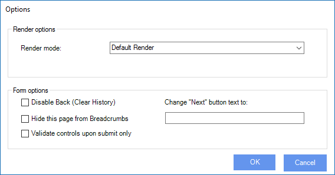

| __Properties__ | Description |
|----------------------------------------|-------------------------------------------------------------------------------------------------------------------------------------------------------------------------------------------------------------------------------------------|
| **Render Mode**                        | You can choose the render mode to define how AgileDialogs render the pages. Available values are **Default**, **Continuous** and **Popup**. Each render mode is explained at its own section.                                                   |
| **Disable Back (Clear History)**       | If checked, when the dialog arrives to this page, the dialog history is cleared and the Back button becomes disabled. This is useful when the dialog designer decides to block the user from going back to previous steps before this one |
| **Hide this page from breadcrumb**     | If checked, the page will not show its *breadcrumb* functionality on the upper-left hand side of the page.                                                                                                                                |
| **Change *Next* Button text to**       | When filled in, it changes the caption of the predefined *Next* button on the lower right corner of the Dialog, to the literal we have entered.                                                                                           |
| **Validate controls upon submit only** | By default, AgileDialogs validates and shows the validation message label each time user changes selected control. If checked the form will be only validated on navigation                                                               |

## Control Configuration

The control configuration window has three tabs:

-   Configuration tab

-   Help tab

-   Advanced tab

### Configuration tab.

These are the properties used in the configuration of a control:

-   **Value Variable**: this is the name of the variable to store the value that
    the user enters/selects at runtime. This name **must be unique** at page
    level. It does not need to be unique in the whole dialog, but its value is
    to be referenced and used in another place, using this format
    *\${ValueVariable}*, then the dialog designer should make sure a duplicate
    variable in another Page is not interfering inadvertently.

    **Important**: There are certain restrictions about naming this property. It
    is important not to give a value to this property that match with the
    following system-reserved keywords:

> -   "ACTION" 
> -   "WID"
> -   "WOID" 
> -   "PIID"
> -   "CURRENTWIDISPLAY"
> -   "dialogState"
> -   "AID"
> -   "ContinueWID"
> -   "lcid"
> -   "orgname"
> -   "s508"
> -   "ProcessParams"
> -   "ProcessNotes"

-   **Label Variable**: when the control is a checkbox or a radio-button, there
    are 2 values to take into account when the user selects an option, one is
    the internal value (stored in the *ValueVariable*) and the other is the
    display name. For instance in a list of Contacts in a combo, when a user
    selects one, the *ValueVariable* is set to the ID of the contact and
    *LabelVariable* is set to the name of the contact (as seen on the form).
    This value can be used in other steps using this format *\${LabelVariable}.*

    **Important**: There are certain restrictions about naming this property. It
    is important not to give a value to this property that match with the
    following system-reserved keywords:

> -   "ACTION"
> -   "WID"
> -   "WOID"
> -   "PIID"
> -   "CURRENTWIDISPLAY"
> -   "dialogState"
> -   "AID"
> -   "ContinueWID"
> -   "lcid"
> -   "orgname"
> -   "s508"
> -   "ProcessParams"
> -   "ProcessNotes"

-   **Type**: This is the type of the control. This field is read-only and is
    set when a new control is added to the Page.

-   **Control caption**: This optional text area contains the text presented to
    the user. This text can be formatted (color, size, italics, bold, etc.). It
    can also contain images.

>   The content of the caption can include dynamic values using
>   *\${variablename}* syntax. The context button
>   can be used to open the context window and include dialog variables in the
>   caption. To paste content from other applications use the Paste button
>   provided. Not all HTML content is supported by this configuration tool and
>   content copied from applications like Word, for instance, can cause
>   unexpected behaviors.  
>   To insert blank lines in the caption use Shift+Enter.

-   **Options**: When the selected control shows a set of options to the user
    (combo control, radio, ...), these options can be configured as static (set at
    design time) or dynamic (can be linked to a filtered lookup in the XRM
    repository). For this controls the *Options* region is enabled:

### Help tab

-   The Help tab is used to configure HTML content to help the user with this
    control. This help is presented in a modal window at runtime:

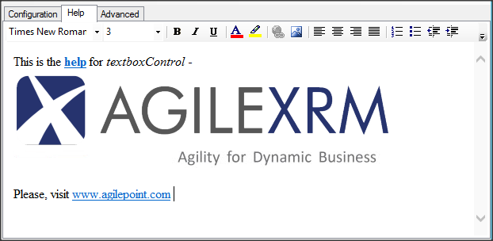

>   If a control has Help content, a Help icon is shown next to the control,
>   that when clicked will open the contextual Help window

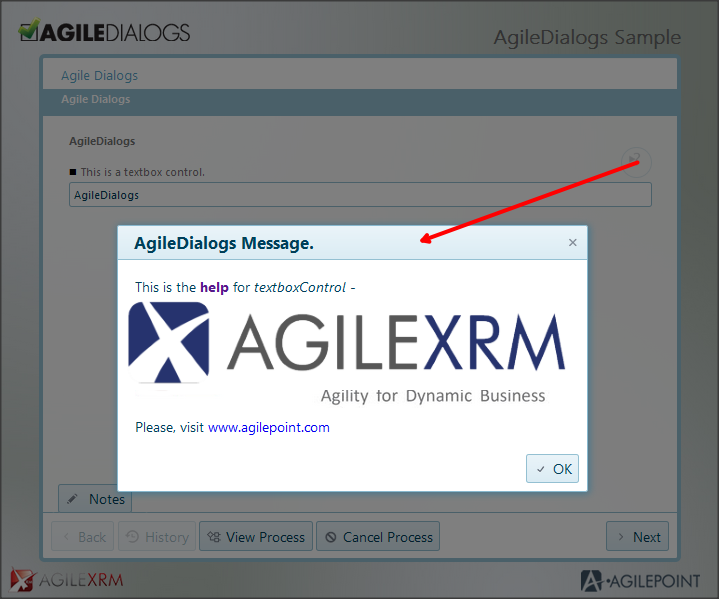

>   This HTML content can have references to external images. The images should
>   be hosted in a web server and the URL should be accessible at runtime by the
>   user.

### Page Canvas

The Page canvas is rendered with Responsive Design, meaning that the screen
real-estate is used to show the controls in an optimal way.

The width of the Page is divided into 12 columns and each control can occupy a
certain number of columns as defined by the *ColumnSpan* property in the
*Advanced* tab.

### Control Configuration Advanced Tab 

Each type of control has a set of specific properties to configure its behavior.

These specific properties are configured in the *Advanced* tab.

Besides these specific properties, there are some properties common to all
controls.

Common properties are:

-   **Required**: When *true*, the user must select or introduce a value for this
    control in order to continue to the next Page. This is also shown in the
    *Configuration* tab.  
    

    

-   **AllowAlign**: When *true*, the control will be rendered after the previous
    control in the same row (if space is available). This is used for presenting
    several controls in the same row

    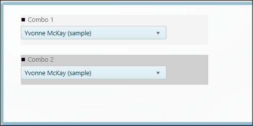

    

    Allowalign property can be set by control configuration panel as well.

    

-   **ColumnSpan**: This is the number of columns (1 to 12) that the control
    container (including the caption) will occupy. Controls will be rendered
    using the value of this property in combination with *AllowAlign* property.  
    

    

      
    Valid values are from 1 to 12.

-   **ControlWidth**: this is the width of the control inside in the control
    container, which itself has 12 columns.  
    

    

      
    Valid values are from 1 to 12.

    **Description**: This is the text of the tooltip to show on the control.  
    

    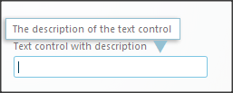

      
    This tooltip is only shown when the control has the focus.

-   **DefaultValue**: This value is set when the question is loaded at runtime.
    This is the default value of the control and is only used if the control
    does not have a value already. In selection controls, this value must be the
    value of the option, not the display name.

-   **IsReadOnly**: When true the control does not allow the user to change its
    value.

-   **CssClass**: This allows customizing the aspect of the control via CSS.
    Please refer to AgileDialogs Customization Guide.

-   **Visible**: This feature allows us to toggle the initial visibility of a
    created control, by setting its value to **true** or **false**.

Control-specific parameters are explained for each Control-type below.

## Preview Configuration

While configuring a Dialog the user that is modeling has a design-view preview
of the Page (bottom right panel):

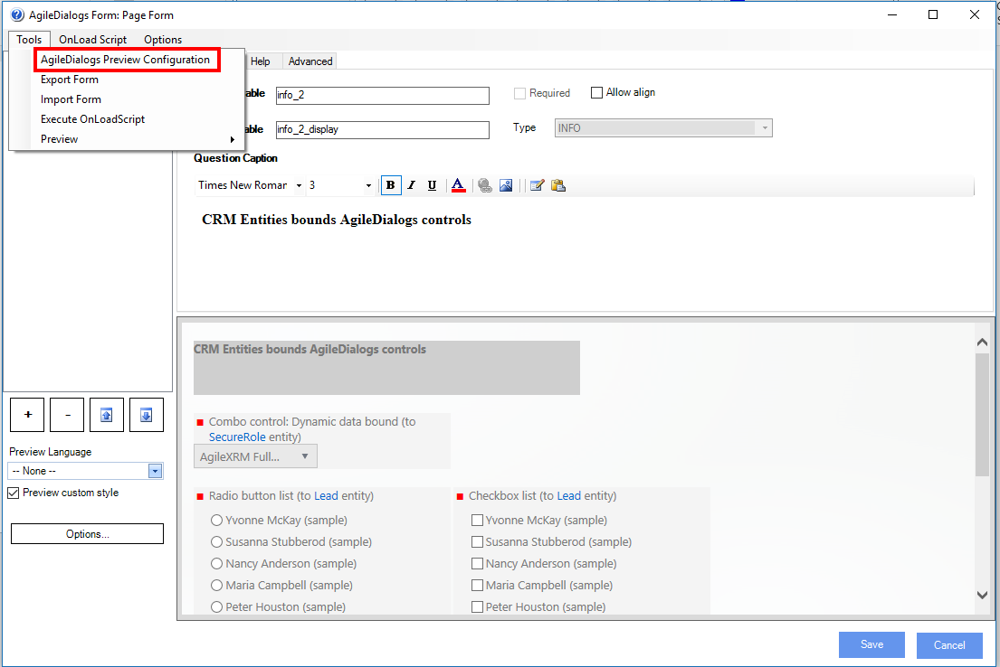

In order to make this preview work, the very first time the Page editor is
opened, it is necessary to set a configuration setting.

To set preview configuration click in ToolsAgileDialogs Preview Configuration
menu and set the right URL in this window:

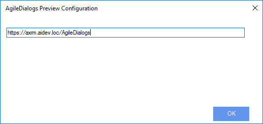
