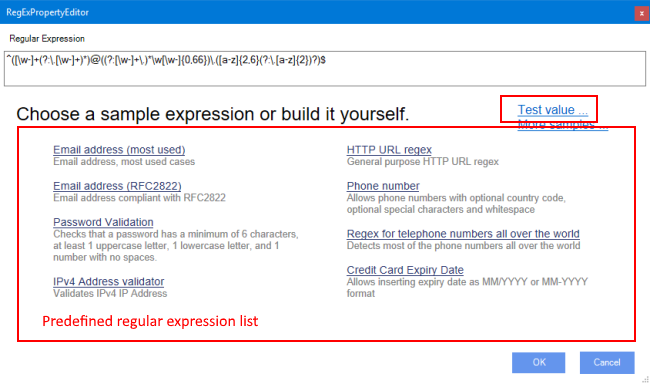
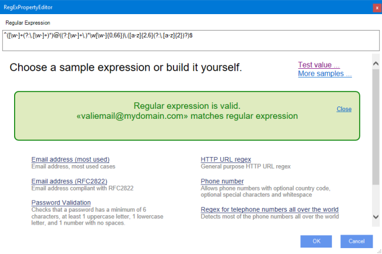
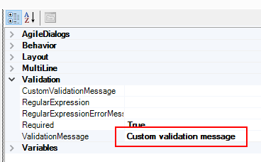
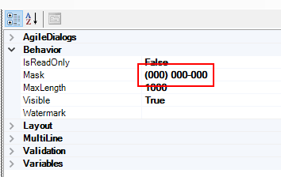
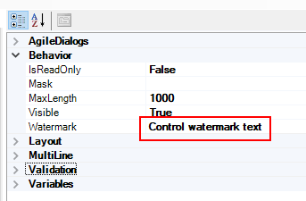

__[Home](/) --> [AgileDialogs design guide](/guides/AgileDialogs-DesignGuide.md) --> Textbox__

### Textbox

-   **MaxLengh**: This is the maximum length of characters allowed in the textbox.
-   **Lines**: The number of lines used to show the control in form. When it's greater than 1 multiline property is set to true.
-   **Multiline**: When *true*, the control allows multiple lines of text:

    

-   **RegularExpression**: This field allows including a valid javascript regular
    expression to validate the content of the textbox.  
    The validation is only applied if the Textbox has content.  
    Multipe regular expressions can be concatenated with the pipe \| character,
    if needed.

	

	The regular expression editor allows user to get a predefined regular expression, built your own and test it.

	

-   **RegularExpressionErrorMessage**: This property allows to set a custom
    validation message for regular expression validation.

    
    

-   **TextControlContentType**: The values allowed are: String, Number, Decimal
    and DateTime.  
    The format of the text is validated to check that it corresponds to the type
    specified in this field (the content of the validation message can be set in
    *ValidationMessage* parameter).

    
      
    When TextControlContentType property is set to DateTime control stores the value variable using ISO-8601.

    When TextControlContentType property is set to Decimal control stores the value variable using invariant culture.

    > Note: This property is deprecated and is there for backward compatibility. It
    will be removed in a future version. Use the Calendar and Currency controls instead.

-   **ValidationMessage**: The message that will be presented when the content
    does not match the validation rule:  

    

    

-   **Mask**: Specifies the input mask for the Textbox control.  

    

    

>   The following mask rules are available:
> -   **0** - Digit. Accepts any digit between 0 and 9.
> -   **9** - Digit or space. Accepts any digit between 0 and 9, plus space.
> -   **\#** - Digit or space. Like 9 rule, but allows also (+) and (-) signs.
> -   **L** - Letter. Restricts input to letters a-z and A-Z.
> -   **?** - Letter or space. Restricts input to letters a-z and A-Z.
> -   **&** - Character. Accepts any character.
> -   **C** - Character or space. Accepts any character.
> -   **A** - Alphanumeric. Accepts letters and digits only.
> -   **a** - Alphanumeric or space. Accepts letters, digits and space only.
> -   **.** - Decimal placeholder. The displayed separator will be that of the current culture.
> -   **,** - Thousands placeholder. The displayed placeholder will be that of the current culture.
> -   **\$** - Currency symbol. The displayed symbol will be that of the current culture.

> **Known Limitations**
> To restrict the typed value, the Mask property "listens" to input events such as keydown and keypress.
> In some mobile browsers, mostly Android or the Windows Mobile OS built-in browsers, those events do not trigger at all. As a result, the normal behavior of the mask is prevented because they are fundamental for the typing restriction.
> Recent tests show that the mask property works in the latest iOS OS version.
> You cannot work around these issues, because no other reliable way to detect typing in mobile browsers exist-virtual keyboard does not raise any other specific events.

-   **Watermark**: Specifies a default watermark text that is shown inside the textbox as a help to the user.
   
	

	
<!--    > __Note__: The Display Variable for Textbox control is deprectaed and is there for
backward compatibility. It will be removed in a future version.
-->
## Disclaimer of warranty

[Disclaimer of warranty](DisclaimerOfWarranty.md)

