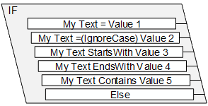
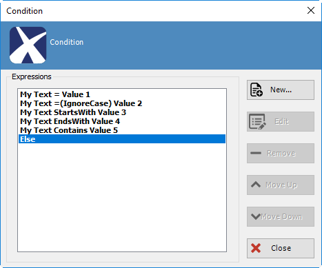
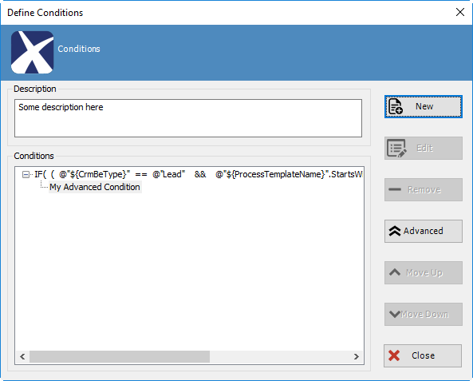
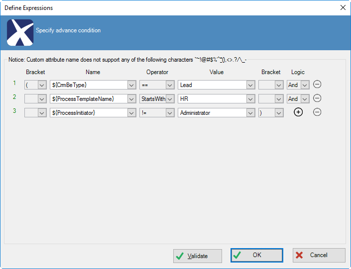
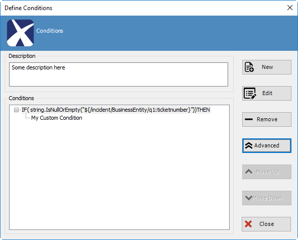

__[Home](/) --> [Reference](/ref) --> Multiple condition__

# Multiple condition

A condition activity that can branch into multiple routes if the Rule is *True*.
The Process follows the *first* Rule that is met in the list, even if following
Rules are also *True*. The order of the Rules can be changed.

## Configuration Dialogs

There are three ways to configure this shape:

1.  Simple Mode
2.  Advanced Mode
3.  Custom Mode

### Simple Mode

| Field Name / Button                              | Definition                                                                                                    |
|--------------------------------------------------|---------------------------------------------------------------------------------------------------------------|
| __Name__                                         | See [(Name)](common/Name.md)                                                                                                |
| __Data Binding__                                 | See **Property Binding**                                                                                      |
| __Description__                                  | See [Description](common/Description.md)                                                                                            |
| __Type__                                         | See [Type](common/MultipleConditionTypeProperty.md)                                                               |
| __Ellipsis (...)__                                 | Opens the dialog for selecting a process variable or context data. See [Schema Selector](common/SchemaSelector.md)              |
| __Advanced Mode__                                | Click to configure shape in **Advanced Mode**                                                                 |

| Field Name / Button | Definition                                                                                                                                                                                                                                                                   |
|---------------------|------------------------------------------------------------------------------------------------------------------------------------------------------------------------------------------------------------------------------------------------------------------------------|
| __New...__      | Add a new expression                                                                                                                                                                                                                                                                   |
| __Edit__      | Edit an existing expression                                                                                                                                                                                                                                                            |
| __Remove__      | Remove an existing expression. (Remember to remove any orphaned connectors)                                                                                                                                                                                                          |
| __Move Up / Down__      | Select an expression and use these buttons to change the order of the expressions. The shape executes the expressions in this order and as soon as an expression is evaluated to TRUE, the corresponding route is followed and the rest of the expressions are not evaluated |

| Field Name / Button                              | Definition                                                                                                                                                                                                                             |
|--------------------------------------------------|----------------------------------------------------------------------------------------------------------------------------------------------------------------------------------------------------------------------------------------|
| **Name**                                             | See [(Name)](common/Name.md)                                                                                                                                                                                                                 |
| **Operator**                                         | [Operator](common/MultipleConditionOperatorProperty.md)                                                                                                                                                                                      |
| **Value**                                            | Type a literal value **TIP**: If you need to use a dynamic value, then use the Advanced Mode **TIP**: You can use this shape to determine whether a String value is null by using the "=" operator and entering the value **\<NULL\>** |

### Advanced Mode

1.  Drop a Multi-Condition Shape on the canvas
2.  Click Advanced Mode button
3.  Click New button

| Field Name / Button | Definition                                                                                                                                                                                                                                                            |
|---------------------|-----------------------------------------------------------------------------------------------------------------------------------------------------------------------------------------------------------------------------------------------------------------------|
| **Description**         | See [Description](common/Description.md)                                                                                                                                                                                                                              |
| **New**                 | Open the Define Expression dialog for adding a new condition                                                                                                                                                                                                          |
| **Edit**                | Edit an existing condition **TIP**: Click F2 or double-click the text below a condition to edit it                                                                                                                                                                 |
| **Remove**              | Deletes an existing condition                                                                                                                                                                                                                                         |
| **Advanced**            | Click to configure this condition in **Custom Mode**                                                                                                                                                                                                                  |
| **Move Up / Down**      | Select a condition and use these buttons to change the order of the conditions. The shape executes the conditions in this order and as soon as a condition is evaluated to TRUE, the corresponding route is followed and the rest of the conditions are not evaluated |

| Field Name / Button  | Definition                                                                                                                                                                                                                     |
|----------------------|--------------------------------------------------------------------------------------------------------------------------------------------------------------------------------------------------------------------------------|
| **Bracket**              | Use for grouping expressions for constructing more complex conditions e.g. (((a = 1) or (b\>2)) and (c=d))                                                                                                                     |
| **Name**                 | Name of the attribute to be evaluated on the left side of the expression **TIP**: In the drop-down click **\<XML Schema\>** to open the dialog for selecting a process variable or context data See [Schema Selector](common/SchemaSelector.md) |
| **Operator**             | [Operator](common/MultipleConditionOperatorProperty.md)                                                                                                                                                                        |
| **Value**                | Either use a literal or a dynamic value **TIP**: In the drop-down click **\<XML Schema\>** to open the dialog for selecting a process variable or context data See [Schema Selector](common/SchemaSelector.md)                                  |
| **Logic**                | Use the AND or OR operators                                                                                                                                                                                                    |
| **\+ - buttons**         | Use for adding more expressions or removing existing expression                                                                                                                                                                |
| **Validate**             | Validates the condition and either shows a success or an error dialog                                                                                                                                                          |

### Custom Mode

1.  Drop a Multi-Condition Shape on the canvas
2.  Click Advanced Mode button
3.  Click Advanced button

| Field Name / Button | Definition                                                                                                                                                                    |
|---------------------|-------------------------------------------------------------------------------------------------------------------------------------------------------------------------------|
| **Expression field**| Use this for building custom expressions in .NET **TIP**: There is Intellisense to help create the expressions                                                                |
| **Schema**          | Opens the dialog for selecting a process variable or context data <blockquote>**NOTE**: Make sure these variables are inside quotes e.g. "\${MyAttribute}"</blockquote> See [Schema Selector](common/SchemaSelector.md) |
| **Validate**        | Validates the condition and shows an error dialog if necessary. It does not show a success dialog if expression is valid.                                                     |

## Shape-Specific Properties

| Property | Description |
| -------- | ----------- |
| **Property Binding** | Click its ellipsis button to open the configuration dialog. The data binding expression that is used to evaluate the value of the condition at runtime. <blockquote>**NOTE**: This field is shown as empty in Advanced and Custom Modes</blockquote> |

## Other Common Properties
All shapes have many other common properties. Look them up here: [Common Poperties](common/README.md)

## Actions
Double-clicking this shape opens its configuration dialog.
