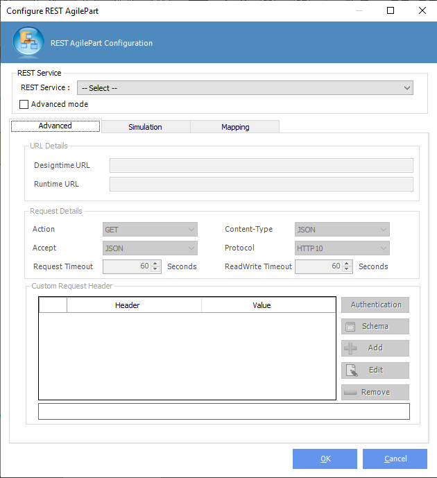
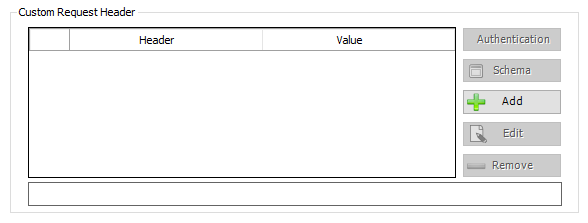
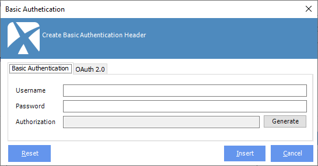
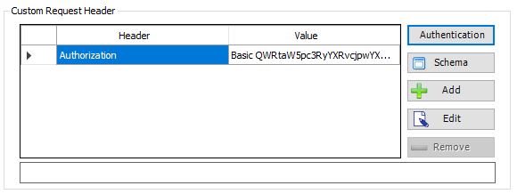
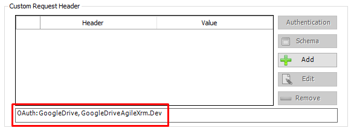
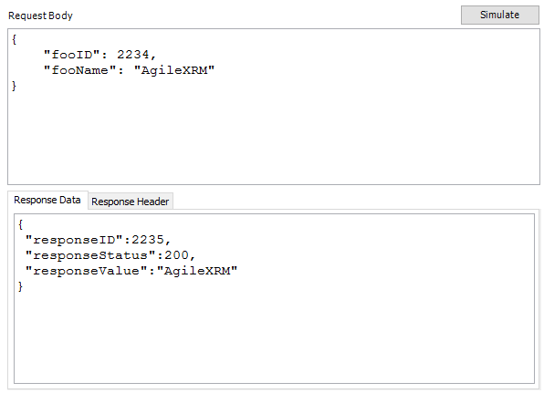
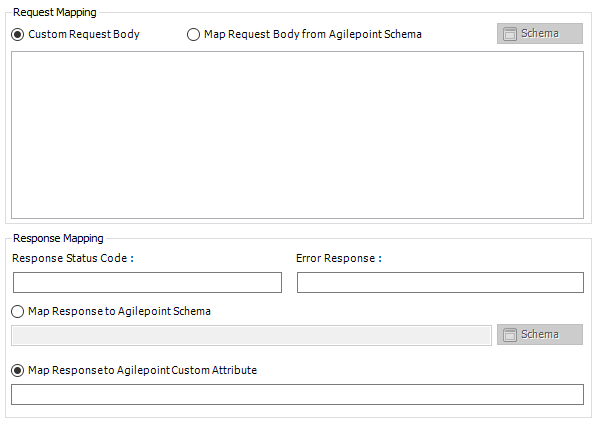
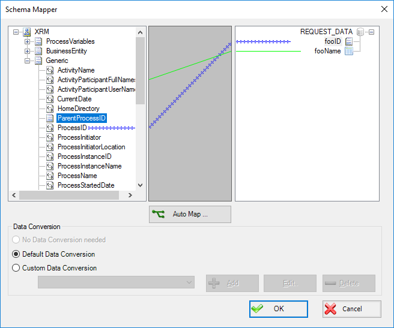
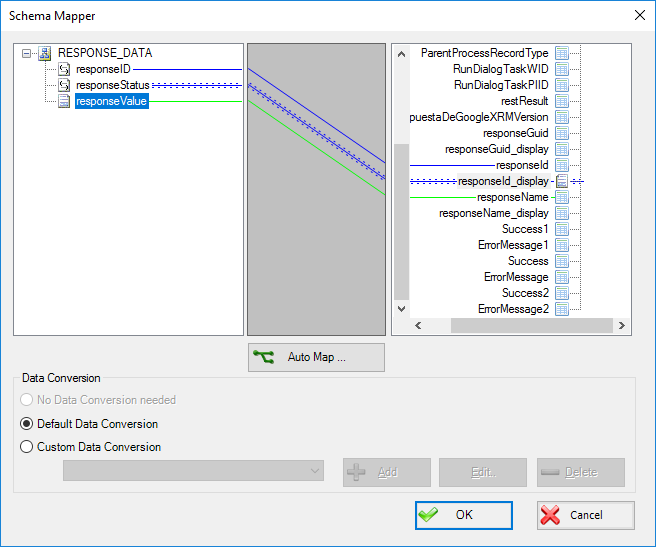

__[Home](/) --> [Reference](/ref) --> REST Service Activity__

# REST Service Activity

This shape creates a REST Service Activity, which allows consuming a REST
Service for retieving data from or sending data to the REST service.

Shape configuration is done through the REST property.

## REST Service activity configuration

The REST property opens the configuration window:

This configuration window has several sections detailed below.

Either configure the REST shape using and existing **[NX REST Access Token](https://documentation.agilepoint.com/SupportPortal/DOCS/ProductDocumentation/CurrentCloud/DocumentationLibrary/maps/cloudenvShapeRESTService.html#RESTAccessToken)**
or setting by the service details in **Advanced mode**.

When a **NX REST Access Token** in selected, the shape fills service details
automatically from AgilePoint NX. The **REST Access Token** must be generated
previously in AgilePoint NX Portal.

When **Advanced mode** is selected we need to set the data in Advanced section.

## Advanced section
Advanced section is disabled when **NX REST Access Token** is used. To enable this
section we need to check the **Advanced mode** checkbox.

The advanced section is divided in turn into three other sections that are
detailed below.

### URL Details

This section allows defining the REST service URL which must be a valid REST
service URL.

Need to enter the URL of the REST service for both design-time and
runtime.

The runtime URL can be static or dynamic based on a context variable.

### Request Details

This section defines the details of service execution.

**Action**: Specifies the type of action for the REST service to do. It is the service verb (GET, POST, PUT ...). Service must support selected action.

**Content Type:** Specifies the type of content the REST service uses. JSON or XML patch files are also supported to patch the document with the specified changes.

**Accept:** Specifies the data format to accept in a REST service.

**Protocol:** Specifies the communication protocol for your REST service.

**Request Timeout:** Specifies the maximum amount of time, in seconds, to complete the REST service call for the activity.

**Readwrite Timeout:** Specifies the maximum amount of time, in seconds, for read and write methods.

### Headers

Use this section to define any header to be sent to the service, including authentication header.

Below is how to define the authentication headers.

#### Service authentication

Add header using **Add** button and then click **Authentication** button to show the authentication window.

REST activity shape allows two kinds of authentication,**Basic Authentication** and **OAuth 2.0 Authentication**. This window creates REST service authentication credentials to connect to a REST service with authentication.

In order to use **Basic Authentication**, type user name and password and generate the authorization header, finally click **Insert** button to insert the authentication header.

To perform the OAuth 2.0 configuration, select the access token from
available lists. The access token must be generated previously in AgilePoint NX
Portal.

By pressing the insert button, the shape is configured to use the access
token. When this shape is configured to use OAuth 2.0 authentication it shows
the access token type and name in the bottom label.

## Simulation

This section allows generating the request and response payload, as well as
simulate a service invocation to get the response data as well.

Is important to keep in mind that the simulate button performs a real call to
the service using the design-time URL defined in URL Details section and then
gets the service response and builds the response data and headers. Alternatively, one can
type the request and response details manually.

This request and response information is used by REST activity shape to get and
set the schema mapping window.

> **Note**: Request body is disabled when GET or DELETE methods are selected in *Request Details* sections.

## Mappings 

Defines how the REST shape executes the service request and
how to map it with the context data of the process.

This sections contains two areas:

1.  *Request Mapping*. Defines mapping for the service Request and how data is
    sent to service.
2.  *Response Mapping*. Defines mapping for the service Response and how service
    data is written to process data.

### Request mapping 

This section defines how process data is mapped to REST service Request and
Response.

It can map the request to custom request body or map request body from AgileXRM
schema. To map request to AgilePoint schema it is necessary that have previously defined
the request format in the Simulation section.

To send schema data to the REST service, select the *Map Request Body
from AgilePoint schema* option and set the mappings details with the schema
mapper window. Use **Schema** button to open the schema mapper window.

> **Important**. Request Data format is derived from the information in the simulation section from request body field.

### Response mapping

Map the service response to the process context scheme or store service
response in AgilePoint custom attribute.

The response status field allows storing the HTTP status code from service
response in process data. The error response field is similar, but stores the
error response.

To map service response to the process context schema select the *Map Response
to AgilePoint schema* option and open the schema mapper window using the
**Schema** button.

> **Important**: Response Data format is derived from information in the simulation section from response data field.

It is also possible to store the service response in AgileXRM custom attribute as well.

## Shape-Specific Properties

| Property | Description |
| -------- | ----------- |
| __REST__ | Opens REST Service activity configuration window |

## Other Common Properties
All shapes have many other common properties. Look them up here: [Common Poperties](common/README.md)

## Actions
See [Actions](common/Actions.md)
