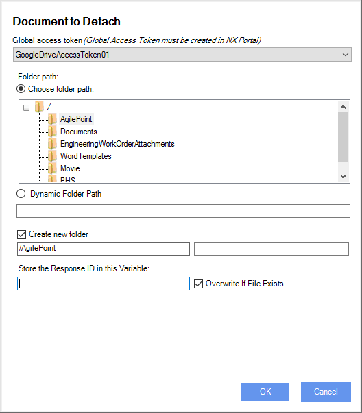

__[Home](/) --> [Reference](/ref) -->  [Parent Shape](javascript:history.back()) --> Destination__

### Destination property 

The destination for the detached file or files.

**Global Access Token:** The AgilePoint global access token to access the source system. 

**Site:** The SharePoint site where destination files are stored. Can be a static value or AgilePoint variable. This field is disabled from non SharePoint document repositories. 

**Document library:** The SharePoint document library where destination documents are stored. Can be a static value or AgilePoint variable. This field is disabled from non SharePoint document repositories.

**Dynamic folder path:** The folder path where destination documents are stored. Can be a static value or AgilePoint variable. This value depends of repository type and its owns API. For example, when document destination is a SharePoint server, this field must contains the folder name, but when document destination is Google Drive this field must contains the folderID of GoogleDrive.

> **NOTE**: For systems that need a folderID, as GoogleDrive, the best practice is store the value in AgilePoint shared variable.

**Create new folder:** Indicates if new folder must be created in destionation
system. Can be a static value or AgilePoint variable.

**Overwrite if exists**: Indicates if the destination file should be overwrite
if exists.

**Delete source files:** Indicates if the source annotation should be deleted
after attach the document.

> **NOTE**: The Process Server (AgilePoint Server) Application Pool Identity
should have Read permission on the file(s)

