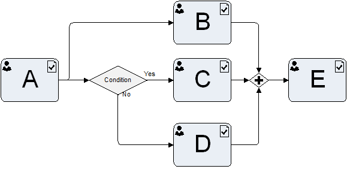

**[Home](/) --> [Reference](/ref) --> [And](../And.md) --> Dynamic**

### Dynamic property 

> **NOTE**: If the AgileShape does not have multiple Incoming-Connectors, then
> this property is ignored at runtime.

When an AgileShape has multiple direct predecessors (e.g. below the AND shape
has multiple Incoming-Connectors leading directly from **B**, **C** and **D**),
this property determines how the predecessor AgileShapes must be exited (at
runtime) before this AgileShape is considered Completed (at runtime).

This property can be set to the following specific values:

-   **True** - This value indicates that the AgileShape will be Completed only
    after all of the AgileShape’s *enter-able* direct predecessors (**B** and
    either **C** or **D** based on Condition) are exited. If any of the direct
    predecessors are *un-enter-able* because conditional logic in the process
    bypassed them (e.g. **D** if Condition was Yes) and therefore
    *un-exit-able*, then those predecessors are not required to be exited before
    this AgileShape is Completed.
	
>   **NOTE**: This behavior is equivalent to the *Wait All Incoming* property in
>   most shapes when set to *True (Dynamic)*

-   **False** - This value indicates that the AgileShape will be Completed only
    after all of the AgileShape’s direct predecessors ( **B**, **C** *and* **D**)
    are exited (at runtime). In above example, Task E will never be reached. Use
    this only when all predecessors are *enter-able*.
	
>   **NOTE**: This behavior is equivalent to the *Wait All Incoming* property in
>   most shapes when set to *True (Static)*
