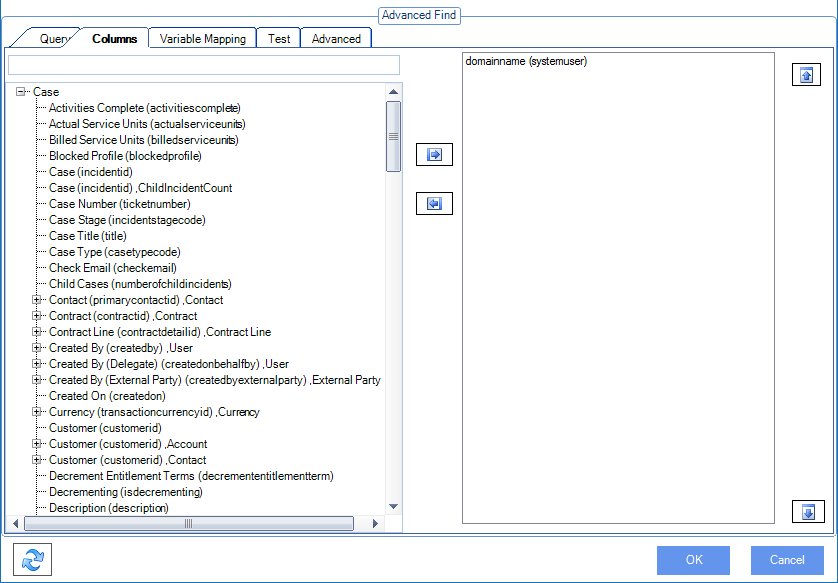
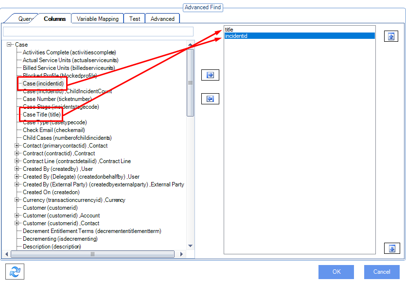
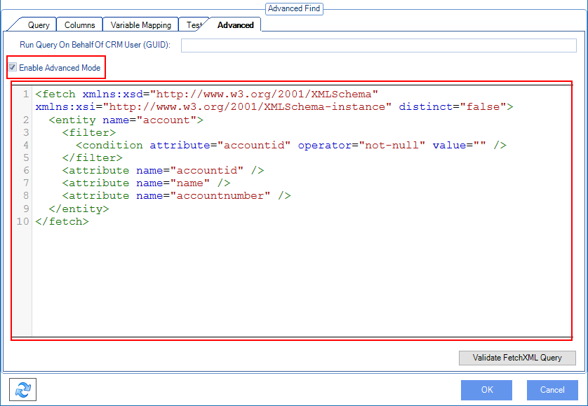
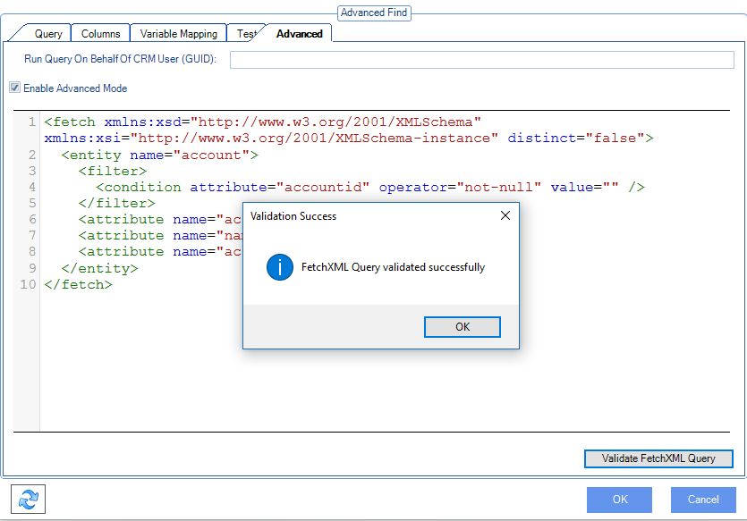
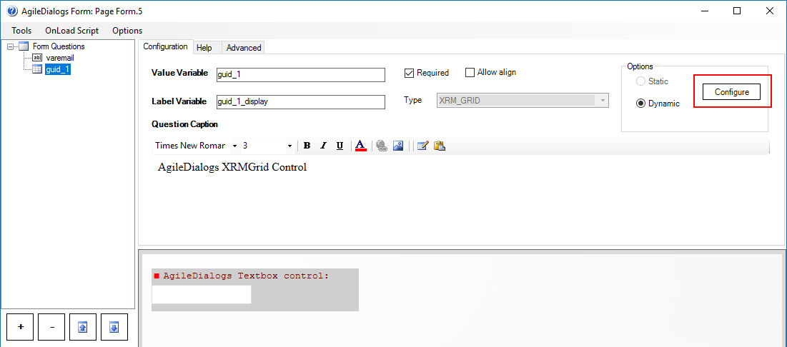
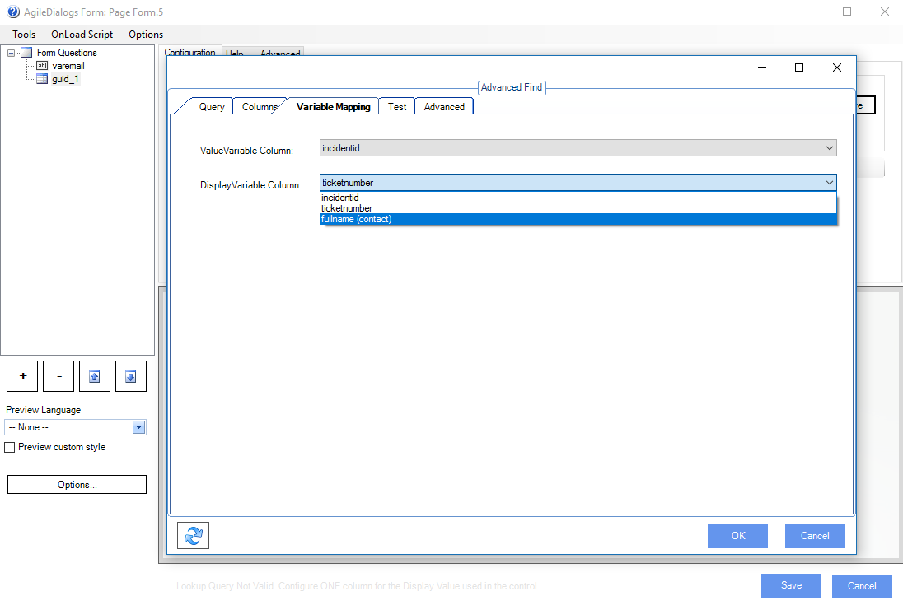
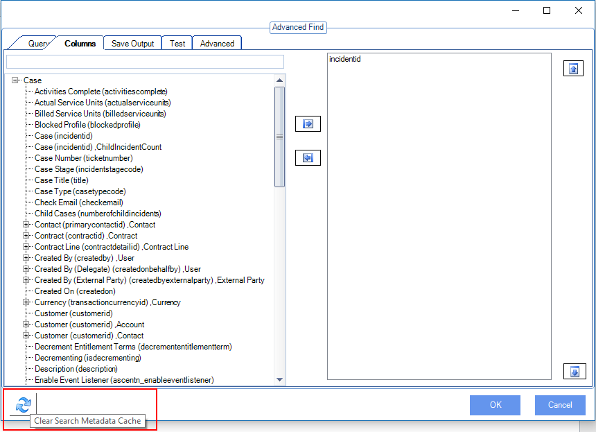

__[Home](/) --> [Reference](/ref) -->  [Parent Shape](javascript:history.back()) --> Query Expression__

### QueryExpression property 

Configure the query to be performed against the selected entities. 

To use, click on the *ellipsis* button to open the Advanced Find window.
 
The config window is divided in different sections:

1. **Tabs section**

2. **Main section**: Depending on the selected tab, shows the corresponding config page

3. **Footer**: Composed of the button **Refresh metadata details**(explained below) 
and the OK/Cancel buttons

#### Tabs section details

##### Query Tab

Contains the actual query to be built; once constructed, when the
process flow reaches this shape, the chosen query would be performed, returning the results 
to the process. 
Configure the query before moving to the other tabs.

To build a new query, click on the dropdown, this will show all searchable entities available:

The entity selection grid appears. To quickly find an entity in the list, type its name partially 
in the *Filter* field. 
Double-clicking a row in the list, selects it and adds a default condition.

Change the query conditions as needed.
Variables can be used on the right-hand side of the operator:

If needed, add new conditions by clicking on the icon next to the selected entity:

The new conditions can be **AND / OR** conditions, as well as **Related Entities**.

##### Columns Tab

After configuring the query to load, the *Columns* tab configures exactly which fields are 
to be returned by the query:

On the left panel is a list of available entity fields to choose from. 
On the right panel is the list of selected fields. 
Click on the center buttons to add / remove items from the selected fields panel.

##### Save Output Tab (Not available in AgileDialogs Page Form)

After selecting columns (fields) in this tab, map them to process variables. 
For instance below, the Case ID and Case Title are mapped to process variables and 
these variables can then be used in the process flow in a subsequent shape.

?? Change image (remove $\{\} )

##### Test Tab

To test the query results using the selected filter (it is
mandatory to configure such query previously), click on the tab and the results
will be shown straightaway.

If the here were any variables in the filter section of the query, example values need to 
be provided for the test tab to show any results

##### Advanced Tab

###### Advanced Queries Mode
For advanced queries, it is possible to configure the query enabling
the advanced mode by accessing this tab, and selecting the *Enable Advanced mode*
checkbox. The *Query tab* would be deactivated, and the query definition would
become editable to perform the desired changes.

After making the changes to the query FetchXML, the syntax can be checked by pressing the *Validate FetchXML Query*
button. If the FetchXML syntax is correct, the following confirmation will be shown:

###### Run Query On Behalf Of Dynamics User
In this tab is also possible to enable query execution on behalf of any user in Dynamics 365/CDS. 
To do that just provide a valid User ID (GUID value) or any variable which contains such value and the query defined
in this shape will be performed on behalf of given user on runtime.

##### Variable mapping Tab (Available in AgileDialogs Page Form Only)
In AgileDialogs designer, there are certain user-selectable controls (XRMGrid, XRMlookup, Combo, RadioButton and
Checkbox) that may be configured to access CRM data. When configuring one of these controls (e.g. XRMGrid):

By clicking on *Configure* button, the *Advanced Find* window will open, but
instead of the *Save Output* tab, there will be a *Variable Mapping* tab.

After setting the fields to be returned by the query, *Variable Mapping* tab
will allow mapping a column to the control's **ValueVariable**, that is going to hold the internal 
value of the selected row, and **DisplayVariable**, which will have the display name of the selected row.

#### Footer section details

**Clear Search Metadata Cache** button 

The metadata information obtained from the CRM
Entities and Fields is subject to change. By pressing this button, the metadata is refreshed.
It is important to use this functionality whenever there is any CRM customaztion while modelling the process.

